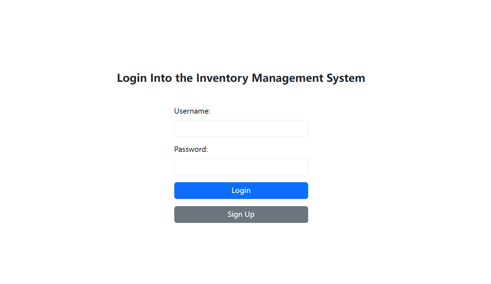
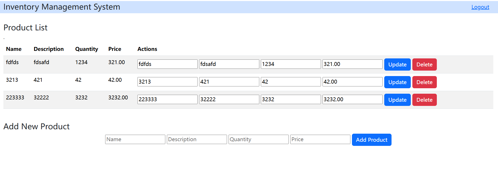

# web-api-demo
A mini inventory management platform based on web, rest API and database.

**features**
- Flask based web application
- Using Azure Database for MySQL server for cloud database and Azure Web App for deployment
- Basic CRUD APIs to manage the database operations
- Implement endpoints for creating, reading, updating, and deleting records.
- Including basic authentication and account management(register, login, logout)
## Table of Contents

- [Requirements](#Requirements)
- [Usage](#Usage)
- [Deployment](#Deployment)
- [License](#License)
## Requirements
- Python 3.x
- pip
## Usage
You can give it a try at [here](https://inventory-web-gqcfa5g4chdyabbx.canadacentral-01.azurewebsites.net/)
1. Login and sing up page, allow users to login in with the account registered in the sign up page. 
2. Inventory management page which allow users to view, add ,delete, update good information. 
3. Click logout button on the top-right to logout the system
## Deployment
This demo uses Azure. If using another cloud service platform, please make the necessary adjustments according to the specific platform.
### Create Cloud Database
1. Go to Azure Database for Mysql servers, click **create**
2. Choose you resource group, regin and set up authentication(admin username and password), fill other fields and complete creation, wait for its development to be done
3. Configure Networking and Sever parameters, add the host server ip to the Firewall rules and set require_secure_transport server parameter to OFF in parameter setting(set ON if you use TLS/SSL connection)
4. Connect to database using cloud/local mysql client, create database user account that will be used in the web application, make sure the necessary PRIVILEGES are granted
### Create Azure Web App
1. Go to Azure Web App, click **create**,choose runtime stack as python 3.x, enable public access, fill the other fields and complete creation
2. Under the Settings -> Environment variables of your web app, add your mysql connection authentication keys and values
### Pipeline
1. Fork this repository
2. Go to Deployment Center of you Azure web app, connect your GitHub repository to this app in the Source section, Azure will automatically configure the Repository secrets and Actions for you under the repository.
### Push and Test
1. Clone the repository to your local machine, conduct some modifications at your will, push the code
2. Check the pipeline status, when it's done, use the Default domain presented on the Azure web app page to access your application
## Lisence
Apache License 2.0